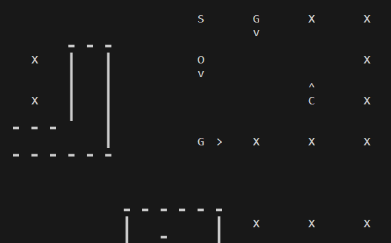

# Projet IA02 - Hitman

## Binôme de projet 60:
- Guenchi Jawed
- HERMOSO Guillaume


## Sommaire:
- [Prérequis](#prérequis)
- [Phase 1](#phase-1)
    - [1.1 Strategie](#11-strategie)
    - [1.2 Heuristique](#12-heuristique)
    - [1.3 SAT](#13-sat)
- [Phase 2](#phase-2)
    - [2.1 Strategie](#21-strategie)
    - [2.2 Modelisation STRIPS](#22-modelisation-strips)
- [Lancer le projet](#lancer-le-projet)


## Prérequis
Avant d'exécuter le code, assurez-vous d'avoir les éléments suivants :

- **Le fichier hitman.py doit se trouver dans le dossier 'src/arbitre/'.**
- **L'executable gophersat doit se trouver dans le meme dossier que main.py**

- Les modules suivants doivent être installés :
    - `os`
    - `pprint`
    - `random`
    - `time`
    - `itertools`
    - `typing`
    - `sys`
    - `copy`
    - `subprocess`


## Phase 1

### 1.1 Strategie 

- Appliquer une stratégie de début de partie.
- Tant que toutes les cases n'ont pas été explorées :

    - Trouver les cases inconnues les plus proches.
    - Prendre comme but la case inconnue la plus proche, accessible.
    - Appliquer l'algorithme A* pour trouver le chemin optimal vers la case permettant de voir la inconnue.
    - Transformer le chemin en une liste d'actions à exécuter.
    - Exécuter les actions, mettre à jour les connaissances et afficher si nécessaire.
    - Tourner le personnage dans la direction de la case inconnue.

### 1.2 Heuristique 

On a eu besoin de plusieurs heuristiques pour résoudre le problème:
- distance de Manhattan, qui permet de trouver la case la plus proche de la case actuelle.
- la case ou on est est elle vu par un ennemi.

pas utilisé car pas assez performante:
- nbr de mur entre but et case actuelle
- distance euclidienne
- nombre de case inconnue proche
- nombre de case inconnue proche vu par un ennemi
- nombre de mur autour de la case inconnue
- nombre de case inconnue autour de la case inconnue
- nombre d'obstacle (garde ou mur) entre but et case actuelle


### 1.3 SAT 
#### 1.3.1 Choix de modélisation 
  
- Le plan est le suivant :
  
    1. Trouver une/des variable(s) à déduire, les implémenter dans une liste
    2. Pour chaque élément de la liste, tester sa négation et voir si le solveur renvoie insatisfiable
    3. Si oui : inclure la nouvelle variable dans notre dico de connaissances et également dans nos clauses (en tant que clause unitaire)
    4. Si non : Ne rien déduire
- La nature des variables sont des coordonées de personnes potentielles ( du type "ij_P") qui sont convertit en entier (admissible pour le solveur) avec un dictionnaire de conversion position-> valeur avec la clé la position potentielle et la valeur de cette clé un entier. Une valeur vaut donc une position potentielle d'une personne. 
- Pour la recherche des variables à déduire, nous nous sommes limités aux variables déjà présentes dans la base de clauses et qui ne sont pas déjà des clauses unitaires ( 
 on ne prends que des variables qui sont présentes donc dans les clauses d'écoute), cela permet de ne vouloir déduire que ce qui a déjà été évoqué.
- Le tableau de clause (ClauseBase donc List[List[int]]) ne contient que des clauses référents à des personnes soit vu par Hitman (unitaires) soit écoutés.
- Les clauses d'écoutes sont crées à partir d'une fonction python, qui, pour chaque situation de Hitman, c'est a dire du nombre de cases autour de lui( si il est situé près d'un mur, un coin , etc...Sinon il y a un rayon d'écoute de 2 cases autour de lui (25 cases en tout)) et du nombre de personnes k écoutés, générait soit une base de clauses avec la fonction exactly(k,liste_variables), soit une base de clauses at_least(5,liste_variables) si le nombre de personnes entendues dépassait 5. 
- Du fait du nombre de clauses en fin d'exploration (~500 000), le parcours de la carte prends plus de temps avec des déductions que sans. Cependant, le solveur arrive parfois à deviner les positions des gardes et des civils sur la carte.

  
#### 1.3.2 Problèmes rencontrés 

Lors de l'implémentation du solveur SAT, nous avons rencontrés plusieurs problèmes tels que : 
- La réecriture impossible d'un fichier SAT à partir de lui même (ce qui nous a contraint à devoir écrire un nouveau fichier de zéro à chaque fois et exploser le temps de calcul )
- Une gestion abérrante du nombre de clauses : Plus la carte est grande, plus le nombre de clauses explose, ce qui nous a limité seulement à l'utilisation du solveur à la potentielle déduction des personnes (gardes et invités ) avec les clauses d'écoutes.

  


## Phase 2


### 2.1 Stratégie 
Pour cette mission, nous devons effectuer une planification, nous avons decider de le faire en utilisant l'algorithme A* afin de trouver le chemin optimal entre notre position actuelle et la case visée. 

La tâche de l'agent Hitman consiste à éliminer sa cible et revenir en (0,0). Pour ce faire, nous avons décidé d'étudier trois chemins différents et de choisir celui qui entraîne le moins de pénalités.

Voici les trois chemins possibles pour atteindre l'objectif, exprimés sous forme d'actions :

1. **Chemin 1** : départ -> corde de piano -> prendre la corde -> cible -> tuer la cible -> (0,0)

2. **Chemin 2** : départ -> costume -> mettre le costume -> corde de piano -> prendre la corde -> cible -> tuer la cible -> (0,0)

3. **Chemin 3** : départ -> corde de piano -> prendre la corde -> costume -> mettre le costume -> cible -> tuer la cible -> (0,0)

Pour chaque chemin, nous calculons la pénalité en fonction des actions effectuées. Nous choisirons le chemin qui présente la plus petite pénalité et nous le ferons réaliser par Hitman.

### 2.2 Modelisation STRIPS 
Notre modelisation est diponible dans le fichier `ModélisationSTRIPS.pdf`

## Force et Faiblesse de notre projet

Forces : 
- Parcours efficace lors des différentes phases ( peu de pénalité ou presque aucune) .
- Utilisation d'une classe de connaissance pratique et modulable en fonction des besoins ( récupérations des données fournis par l'arbitre, ajout de connaissances, compatibilité avec les déductions du solveur SAT en phase 1 )
- Interface graphique pratique et efficace ( on sait ce qu'on voit, ce qu'il reste à voir,l'orientation des gardes, des civils et du joueur ).

Faiblesses  : 
- Déductions du solveur SAT chronophage ( lors de la phase 1 ) du au nombre de clauses, donc une augmentation du temps d'execution ( 10 fois supérieur à la version sans déduction).
- Fonctions heuristiques à améliorer (certaines configurations de cartes nous font perdres beaucoup de points ).
- Code assez lourd et pouvant être amélioré pour être plus efficace. 
        

## Lancer le projet

Nous avons plusieurs exemples de `main` permettant de lancer le projet et ses différentes phases :

- `main_phase1()` : permet de lancer uniquement la phase 1.
- `main_phase2()` : permet de lancer uniquement la phase 2.
- `main_phase1_2()` : permet de lancer à la fois la phase 1 et la phase 2.

Ces trois `main` font appel aux fonctions suivantes :

```python
def phase1(hr: HitmanReferee, sat=False, affichage=False, temp=0.5, cb_de_temp=True):
    # Voir src/phase1.py
```
Pour la phase 1, vous pouvez choisir si SAT sera utilisé ou pas pour deduire des informations. Vous pouvez également choisir si vous voulez afficher la carte à chaque itération et le temps de pause entre chaque itération. Cb_de_temp permet d'afficher le temps de calcul de la phase1.

```python
def phase2(hr: HitmanReferee, con: HitmanKnowledge, affichage=False, temp=0.5):
    # Voir src/phase2.py
```
Pour la phase 2, vous pouvez choisir si vous voulez afficher la carte à chaque itération et le temps de pause entre chaque itération.

L'affichage 
- Pour la carte : "O" est Hitman et la flèche ("^",">","v","<") représente la direction dans laquelle il regarde actuellement, idem pour "G" : Garde et "C": Civil.
- "X" : Non découvert
- "A" : Arme (Corde de piano)
- "S" : Suit ( Le déguisement)
- "|" ou "-" : les murs de la carte 
- "P" : represente une cible deduite par le solveur SAT mais pas encore vue par Hitman

exemple d'affichage :



## Liens utiles

sujet : https://hackmd.io/@ia02/S1LNF3CMn
arbitre : https://gitlab.utc.fr/ia02/hitman 
